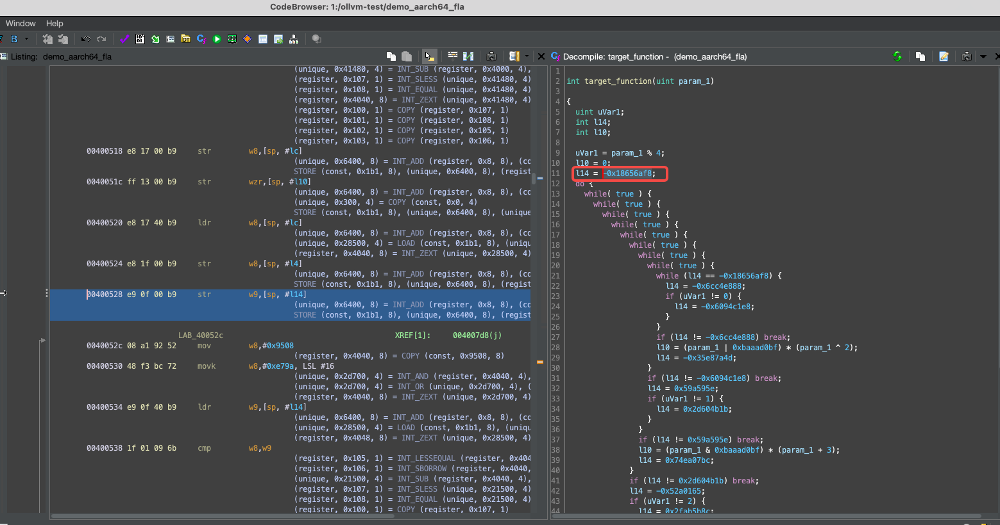

# OLLVM Deflatten Script

[OLLVM](https://github.com/obfuscator-llvm/obfuscator) is a commonly used compiler-level
obfuscation technique.
One of the core feature is called control flow flattenning which adjusts the basic blocks
within a single function to make the decompiled result highly verbose.

OLLVM works on different architectures as it reuses [LLVM](https://llvm.org/) compiler
framework which in turn works on different architectures.

By using [pcode patching feature](./pcode_patch.md), we have achieved half-automatically
OLLVM control flow flattenning deobfuscation.

## Usage

### Step 1: find the script.

Open up the script manager, search for `ollvm_de_flattening.py` script.

### Step 2: find the initial block id number (a magic number)

For each program obfuscated with OLLVM control flow flattening, a bunches of magic numbers
are used to indicate which block is to execute next.

This step requires you to highlight out (by click mouse left-button on the number) the
first magic number.

Normally the magic number will appear above the beginning of the loop.

### Step 3: run the script

By double clicking the script, it should deobfuscate the control flow flatening.

## Supported Architectures

|Arch Names|Support|
|----------|-----------|
|x86|✔️|
|x86-64|✔️|
|arm|✔️|
|aarch64|✔️|
|mips64|✔️|
|ppc64-le|✔️|

## Note

- This only works for OLLVM, not any control flow flattening scheme.